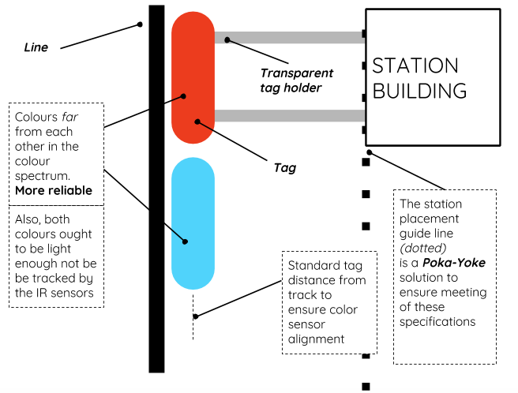

Docking
========

Following a line, Detecting forks and communicating through the internet are not the only things this robot has to do.

Its ultimate goal is to arrive at a destination. Once it reaches the destination, it must stop. In order to stop, it must know when it has arrived at its destination.

A color sensor was added to the bottom of the robot, which looks for a color tag which indicates the station. **Dynamic braking** is applied once destination is reached.

