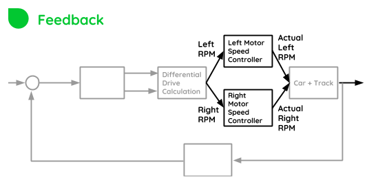

Dual Motor Controller
=====================




**Now that the desired RPMs have been determined (by DiffDriver), The motor must be controlled to achieve its targets.**

This block within the control system is a control system on itself. The entire robot operates on *cascaded controllers*, which are used in this project to fully leverage multiple sensors and that way, enhance the performance of the robot.

Each motor will be controlled according to the following feedback diagram:


To implement the diagram above, it is necessary to:

+ Measure velocity of each wheel (```DualVelocityGauge``` Module)
+ Be able to drive the motor (```DualMotorDriver``` Module)

The motor speed is measured from encoder pulses, in a technique called *pulse counting*

The motor is driven by applying PWM signals. _But this is not enough._

In order to avoid large amounts of current on the motor, the hardware motor driver board has a built-in current limiter. But the current limiter creates a big deadband, making it **hard to control the robot at slower speeds.**

To circumvent that issue, FPWM **(Frequency and Pulse width modulation)** control was implemented.

The frequency control is done by implementing a **“frequency gearbox”**.

+ If the RPM setpoint goes low, the frequency becomes higher.
+ If the RPM goes higher, the frequency goes to an optimal frequency of 100Hz _(determined empirically)_

**The frequency gearbox works by taking advantage of motor inductance**, which will prevent current from achieving stall current levels, and therefore avoiding the current limiter to take action, and reducing deadband.