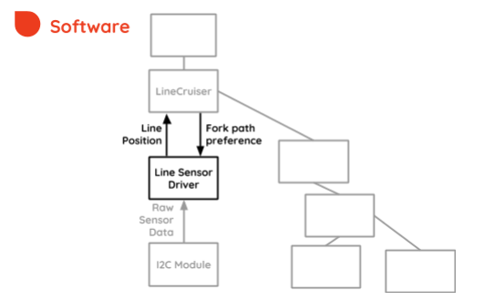
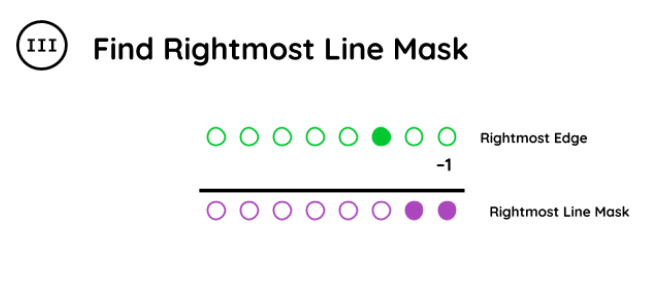

Line Sensor Driver
==================

Module responsible for gathering line sensor data

## Line Sensing

The track is a black line printed onto a white background. Therefore, in order to successfully detect a line, the sensor must

+ Be inherently optical
+ Have many sensor units, to create a “mapping” of the line
+ Be relatively insensitive to external lighting conditions

The sensor chosen for this robot was a **line sensor array**, in particular the **SparkFun Line Follower Array**.
This kind of sensor is the most widely used in robots that need to follow a black line track. 
Its basic principle of operation is that there are 8 IR LED/Sensor pairs, each which measure the reflectance of the surface underneath. If there is a white background, IR light will reflect. Otherwise it will not reflect. Each will be converted into a binary digit. **0 (⚪︎) if white, or  a 1 (⚫︎) if black.**

## Line Sensor Data Transmission

Multiple sensors used *including* the line sensor array can only be interfaced through *I2C*, therefore an ** *I2C module* is needed to communicate with them.**

The *I2C module* was developed based on an example code from Texas Instruments, adapted to fit the current software environment. This module conforms to the I2C communication protocol thus making sensor interfacing possible.

Furthermore, the *I2C module* is used by the *Line Sensor Driver*, in order to properly initialize and provide the sensor with the right commands.

The *Line Sensor Driver* used for this project was developed by reverse engineering the driver library provided by the manufacturer for Arduino platforms.

On each control loop update, *Line Sensor Driver*  will send a Read Register command to the *I2C module*, and then a byte will be returned, **with the raw sensor data (0–255).**

## Sensor Data Processing

Upon receiving the sensor reading, the information will need to be appropriately interpreted and scaled for it to be of use.

Specifically, the following is absolutely necessary for use in the control system:

+ The sensor must be able to separate two different lines when there is a fork on the track
+ If more than one line is detected, only one must be selected for use in the control system 
+ The sensor signal must be directly proportional to the position of the line relative to the robot.

**To separate two different lines, an algorithm was developed based on boolean logic.** In essence, it will detect edges on the reading, create masks to the right of those edges, and then gather each line reading from a bitwise AND operation with those masks. The procedure is explained in detail on the diagram below.

**After the lines have been separated,** a decision is made on which line to follow. The track contains a maximum of two lines, and therefore the decision becomes either **left or right, which will entail the larger loop or the smaller loop.** Refer to the track diagrams below

**After the line to be followed has been selected, it is processed into a number that is proportional to the relative position.**

The LEDs closer to the edges are given higher value. These values are then summed and divided by number of active bits (⚫︎) to get an average value which is an approximation of the position of the line. Lastly, the new value is normalized to be between -1 and 1 for calculation. The process is shown in the diagram below:

