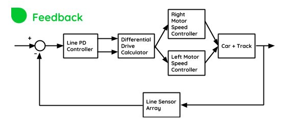
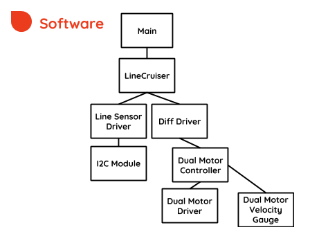
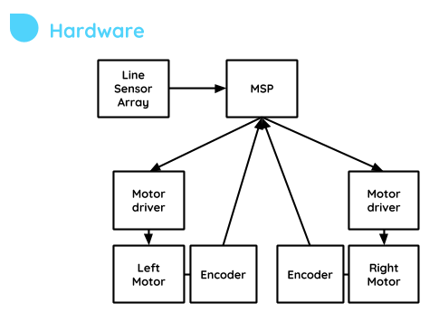
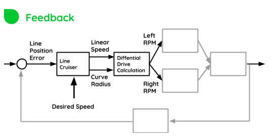
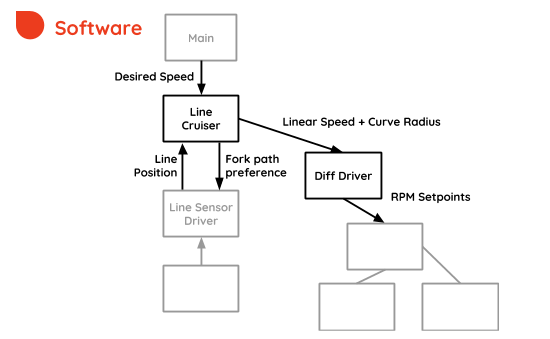
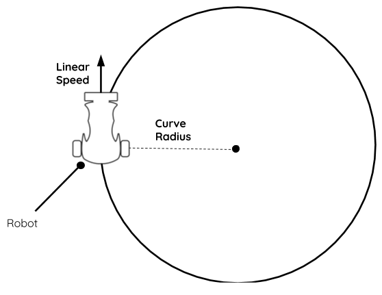
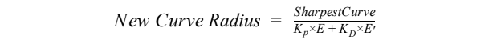
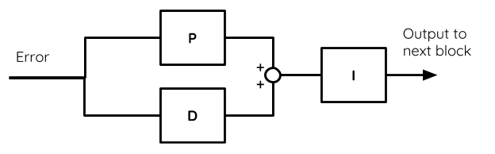

# Control System in General

This module combines many sub-modules to create the control system of the Robot.

When navigating, the robot must control its own motion so that it follows the track line. In this project, the robot uses cascaded closed-loop feedback controls. **Its submodules will be referred to relative to the color-coded diagrams below:**





# Line Cruiser

## Motion Planning




After the sensor position has been calculated, now the motion can be adjusted in attempt to reduce the error and follow the track. 

**First, a model of the motion must be defined.**

The robot motion, by design, is defined by two independently controlled wheels, and the speed of each motor will define two motion parameters:

+ The Linear speed
+ The Curve Radius



**The challenge in motion planning** is to compute a curvature radius which is close to the *instantaneous curvature radius of the track* and be able to drive the robot at that radius and at the specified linear velocity. 

This is achieved by the implementation of a special kind of PID controller.

The first thing to notice is that curve radius should be **inversely proportional** to the total position error of the sensor:

+ If error is **big**, then curve radius should be **reduced**, to turn sharper.
+ If error is **zero**, then the curve radius should be **infinite**, representing a straight line.

The error will be directly proportional to how sharp the curve is.

The equation used is as follows:



So **if E, E’ , Kp  and KD  are smaller than 1 for all feasible conditions** then it follows that the denominator of the equation will be a number between **0 and 1**.

+ If the denominator becomes **zero**, then the robot will go on a straight line
+ If the denominator becomes **one**, then the robot will turn in the sharpest curve it is set to.

After the new curve radius is calculated, its **_inverse_** (which for convenience, we refer to as **_Curve Sharpness_**) is integrated with an integration factor Ki.

The effect of this integration is that if the robot is already turning sharp, but the error persists or gets worse, it will attempt turn even sharper.

The controller has therefore this structure:



Also, some other features of motion planning have been implemented, such as:

+ *Recovery mode:* If the robot misses the line, it will remember its last sensor position, and try to find its way back to the line, while decaying its own speed to an adjustable rate.
+ *P-Brake and D-Brake:* If the robot computes a large errors, it will try to reduce the speed by a certain amount, which is adjustable.

**Now the curvature radius and linear speed of our model have been defined**, these have to be translated into something more understandable by the motors.

Essentially, those two variables get computed into two other variables:

+ Left Wheel RPM
+ Right Wheel RPM

This is done by performing differential drive calculations, which is performed by the ```DiffDriver``` module