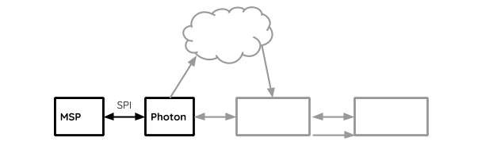
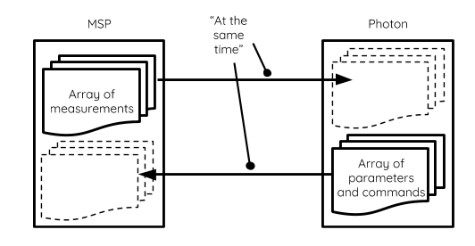

Robot Interface
================

Having a control system does not mean the robot will follow the line perfectly or be useful at all. The control system must be well tuned, and the robot needs to be easily controlled. The needs are as follows:

+ Operator Control of the Robot (_Where will it go? Will it run or stop?_)
+ Efficient Tuning Process (_How does it drive?_)
+ Robot data monitoring and analysis (_What could be wrong?_)

For these reasons, an over-the-air interface with the robot was developed. This system enables:

+ Setting the location of the stations on the track map
+ Choosing the destination of the robot
+ Updating control system parameters
+ Receiving robot measurements in real-time
+ Start and Stop functionality
+ Download of robot data as a CSV spreadsheet format.

**The block diagram for this sub-system is displayed as shown below**

## Serial Communication between MSP and Photon

The amount of data transmitting between the Photon and the MSP430 is relatively large, therefore SPI (_Serial Peripheral Interface_) is chosen since it is fast and does not take too many I/O pins.

Because SPI communicates by **swapping** data, the measurements of the robot such as line sensor reading can be transmitted to the Photon _at the same time_ as the MSP itself receives parameters or commands from the web.

The data simultaneously transmitted between these two devices are put into two arrays that together are called Infoboard. Each device has a copy of the **_Infoboard_**, and will update each other with their half of the board.

Very rarely, a miscommunication will occur due to timing error between devices. This is **especially troublesome** for the controller since the data passed from the Photon are parameters used for the control system. **An error in that data will cause the robot to exhibit unexpected and undesirable behaviour.**

Tuning the SPI transmission to be flawless is impossible given the time constraint and all the software layers that would need to comply, so a checksum algorithm is used to detect and discard corrupted data.

The algorithm of choice was the CRC (_Cyclic Redundancy Check_), which is the simplest algorithm that meets all the three requirements for such problem:

+ Detection of **simple bit errors**
+ Detection of **burst errors** (_Many errors in a row_), common in SPI timing errors
+ Detection of **shift errors** (_Bytes out of order_), a real possibility in SPI timing errors
+ Relatively **low cost computation** (utilizes _XOR_ and _SHIFT_ operations mostly)

A sample code for CRC was reverse engineered and adapted to work with our system.

