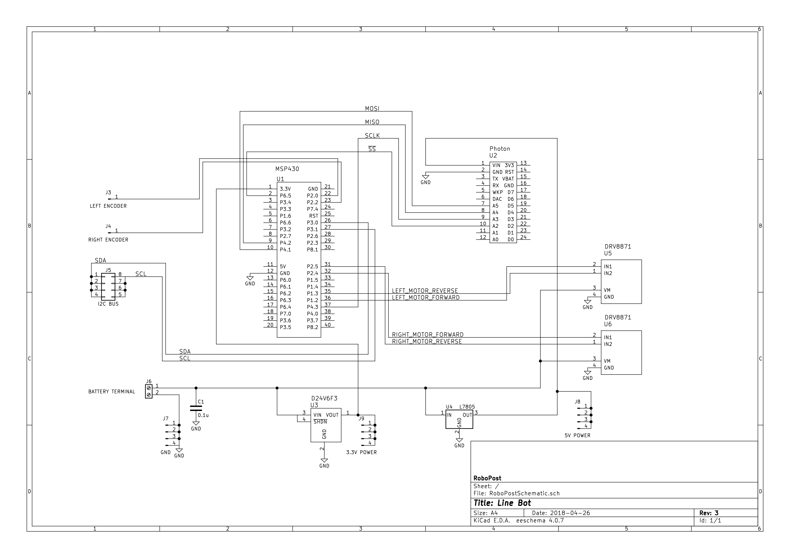
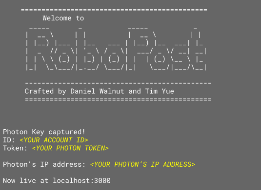


## An autonomous delivery system for BCIT capstone — By Daniel Walnut and Tim Yue

The aim of this project is to build a line following robot that will follow a line at a constant speed and be able to recognize different docking zones scattered around the track and park there.

Check out this video demo on Youtube:

[RoboPost Demo Video – Youtube](https://www.youtube.com/watch?v=mAnifTH91ZA)

**Note:** Project is no longer under active development

# Setting up your own RoboPost

## Getting the hardware

Our custom hardware was designed and built with 3d printed parts, and our own lab-etched PCB boards.
We also made the assembly in a lab.

If you are interested in building your own custom robot based on our design, read on.

If you are interested in ordering a hardware built by us, please open an issue on Github or email Daniel at [me@danielwalnut.com](mailto:me@danielwalnut.com)

### Components needed

1. MSP4305529LP Evaluation Board
2. Particle Photon
3. TI DRV8871 Adafruit Breakout Board
4. 2 6V DC Motors with attached encoder
5. SparkFun Line Follower Sensor Array
6. Grove I2C Color Sensor Module
7. 3d-printed Chassis *(Custom-built)*
8. 3d-printed Motor couple *(Custom-built)*
9. PCB Main Dedicated Board *(Custom-built)*
10. Two wheels
11. Omni-wheel
12. 2 Cell (7.4V) Lipo battery
13. 5V Voltage regulator
14. 3v3 Voltage Regulator
15. Battery Voltage monitor
16. Track *(Custom-built)*
17. Docking Stations *(Custom-built)*

### Schematic

The schematic below is from the PCB Main dedicated board design. It does not include some connections external to the board.



Connections external to the board are done by connecting external pins. This includes:

1. From battery to Battery terminal
2. From motor driver output to motor
3. From power pins (3v3/5v) to sensor power inputs
4. From i2c pins in sensors to i2c bus on the board.

### Installing Software into your computer

Now that you have the hardware, it is time to setup the software!

**Note:** This installation procedure assumes you have a UNIX operating system, such as macOS or Linux, and that you are familiar with the command line. If you are using Microsoft Windows, some steps might be different.
**Note:** This installation procesure also assumes that the RoboPost firmware for both MSP430 and Particle Photon are already flashed into the robot.

1. Remove the robot from packaging.
2. Attach the battery to the velcro tape mount.
3. Connect Voltage Monitor. A loud beep will occur and the voltages should appear on screen.
4. You should see 6.7V minimum on the total voltage monitor. If it is below, it is necessary to charge the battery, or the robot will not work as expected
5. Connect the battery terminals to the Robot.
6. You should immediately see the Line Follower Array and the Photon light up.
7. Setup the Photon to connect to the Wi-Fi network of your choice. *More instructions on that can be found on [https://setup.particle.io](https://setup.particle.io)*
8. Make sure you have Git [https://git-scm.com/](https://git-scm.com/)
9. Clone this repo into your computer
	```$ git clone https://github.com/danielwalnut/RoboPost.git```
10. Generate a keys.json file within the Web folder. This allows the Node.js Application to connect to the correct device.
	```$ cd RoboPost/Web```
	```$ touch keys.json```
	Then open the file, and create its contents, **in the following format:**
	```{```
	```    "ID": <YOUR PARTICLE-ACCOUNT-ID IN DOUBLE QUOTES>,```
	```    "Token": <YOUR PHOTON-ACCESS-KEY IN DOUBLE QUOTES>```
	```}```
	Your keys can be found at [https://console.particle.io](https://console.particle.io)
11. Make sure you have Node.js 8.x.x [https://nodejs.org/en/](https://nodejs.org/en/) and NPM [https://npmjs.com/](https://npmjs.com/)
12. In order to install the required module packages, open a UNIX terminal, make sure you are in the ```Web``` folder and type:
	```$ npm install```
13. Now the installation should have been successful. Make sure the installation happened with no error
14. The software is now setup.

### Operating the Robot

1. After the robot is assembled and software is installed, power the robot by plugging the battery connector with power on the board.
2. Make sure Photon is connected to the same Wi-Fi network as the computer.
3. On a UNIX terminal, go to the ```Web``` folder and start the server:
	```$ cd <path-to-RoboPost>/Web```
	```$ npm start```
4. After a few seconds, you should see on the screen



5. Open your favorite web browser and go to [http://localhost:3000/](http://localhost:3000/)
6. The user interface will be displayed, to adjust parameters, click the cog at top right corner and drag the sliders. To set the robot in motion, click the **play** button on top left corner of the *UI* then press **PB1** on the *MSP430*.
7. To download statistic information, click the **download** button to the left of the cog in the *UI*.

# Hacking RoboPost

If you want to improve the software in RoboPost to suit your needs, you will need to understand the firmware more deeply.

General information about each module can be found in the ```README.md``` of most modules, and deeper information, such as descriptions of each functions can be found in the header ```.h``` files of most modules.

# Questions?

Feel free to open an issue or email Daniel at [me@danielwalnut.com](mailto:me@danielwalnut.com)