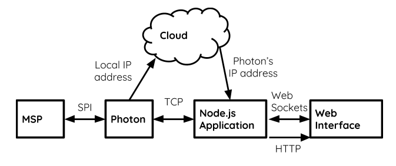
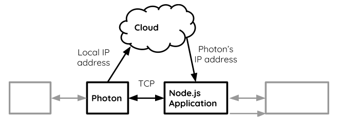
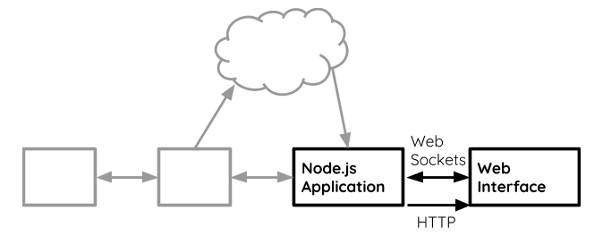
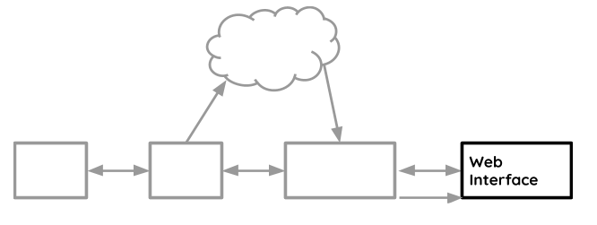
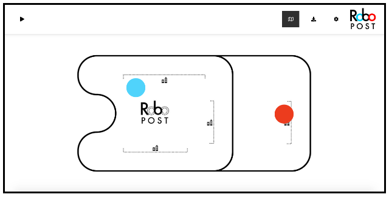
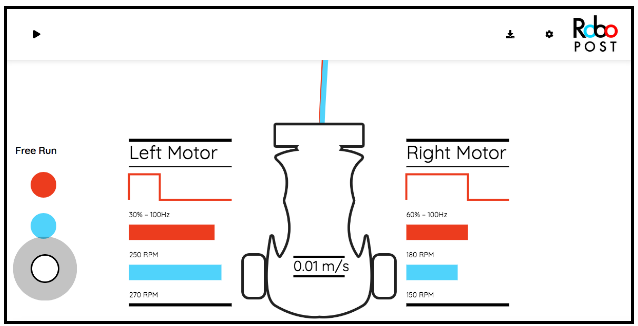

# RoboPost Photon Web Code
## Crafted by Daniel Walnut

## Prerequisites for running

make sure you create a json file called `keys.json`, with your device ID and your key.

here is the content you need to fill in:

```
{
	"ID": "<yourIDhere>",
	"token": "<yourAccessToken>"
}
```

## Interface with the Robot

Having a control system does not mean the robot will follow the line perfectly or be useful at all. The control system must be well tuned, and the robot needs to be easily controlled. The needs are as follows:

+ Operator Control of the Robot (_Where will it go? Will it run or stop?_)
+ Efficient Tuning Process (_How does it drive?_)
+ Robot data monitoring and analysis (_What could be wrong?_)

For these reasons, an over-the-air interface with the robot was developed. This system enables:

+ Setting the location of the stations on the track map
+ Choosing the destination of the robot
+ Updating control system parameters
+ Receiving robot measurements in real-time
+ Start and Stop functionality
+ Download of robot data as a CSV spreadsheet format.

**The block diagram for this sub-system is displayed as shown below**



## TCP — Transmission Control Protocol



In order to achieve the high connection speed necessary for _real-time streaming_ of robot data, utilizing the cloud or HTTP requests is not enough. **A fast socket connection is necessary**

For that reason, the Photon is also acting as a TCP Server. The TCP client is a Node.js Application, which acts as a middle-man between the Robot and the Web Interface.

The TCP Server is capable of:

+ Streaming data
+ Responding to specific requests using unique message identification through random hashes

Because the Photon does not have a static IP address, the TCP connection needs help from the cloud. 

Photon, as soon as it becomes online, will publish its IP address to a secure location in the _Particle Cloud_ through an API (which was given by the manufacturer). This IP address is used to establish connection.

This server will stream all measurements from the _Infoboard_ (Please read README in Photon folder for more), and will update the parameters on requests from the Node.js Application.

## WebSockets and HTTP Server



As mentioned before, the Node.js Application acts as a middle-man between the Robot and the Web Interface. In the previous section, its functionality as a _TCP client_ was covered.

In order for this to be a true middle-man between the two, it needs to:

+ Host the web interface, so that it is accessible from a web browser
+ Be able to stream the measurements data with a high speed connection to enable real-time streaming.

Therefore, the Node.js Application will also act as a:

+ HTTP Server, to host the web interface
+ WebSocket Server, to perform real-time streaming. WebSockets was used because it is the fastest network communication API available for a Web Browser.

## Web HMI — Web Human Machine Interface



The Web Interface is a Human Machine Interface between the Robot and the user.

Features include:
+ Remote Start Stop Button
+ Stations addressing through an intuitive drag-and-drop map
+ Robot tuning through many sliders in a settings panel
+ Choice of destination
+ Real-time graphical measurements display, for maximum intuitiveness
+ Exporting of Robot data to a CSV spreadsheet.

In order to keep the development of the interface organized, an MVC model (Model-View-Controller) was used as a basic software structure.

The interface is shown below:





